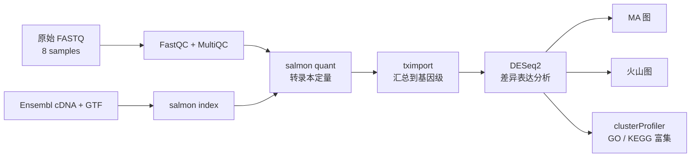
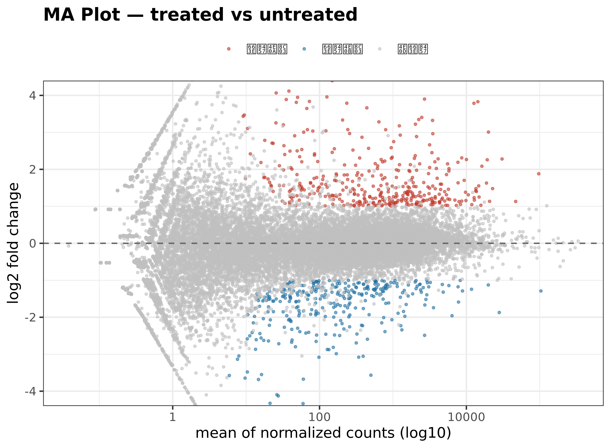
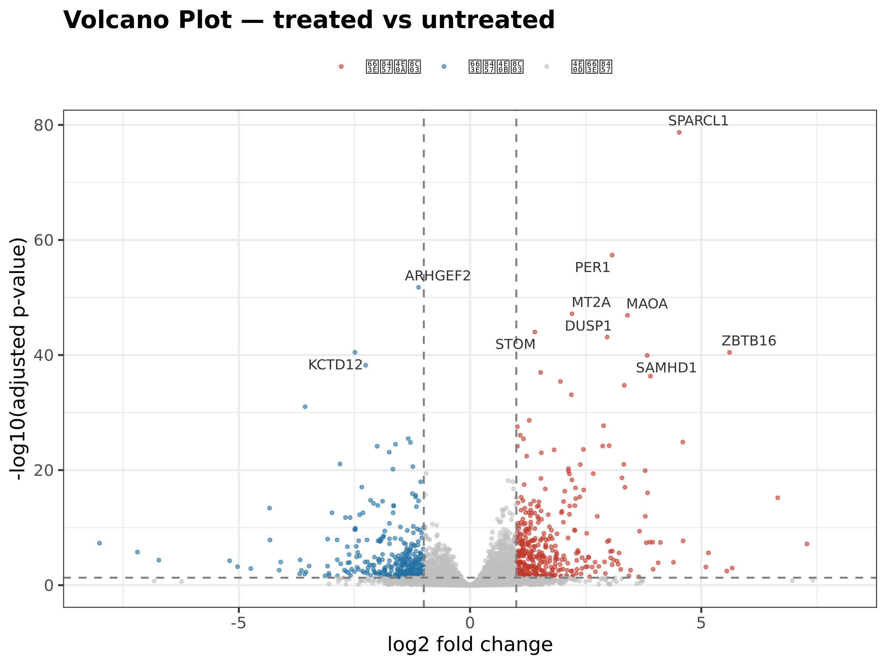
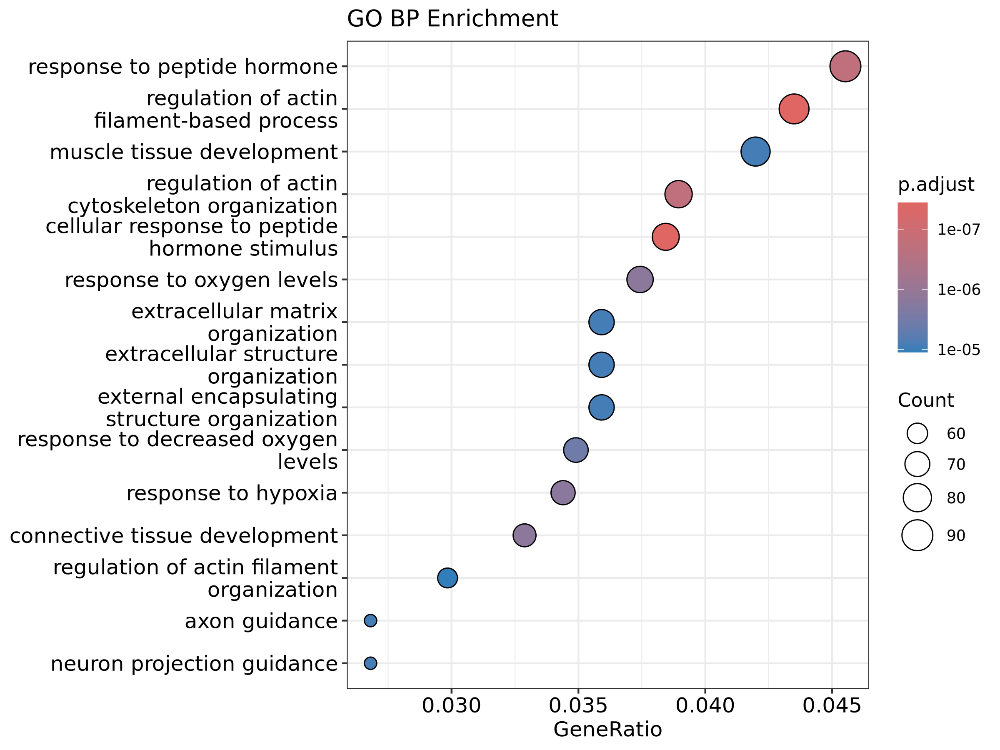
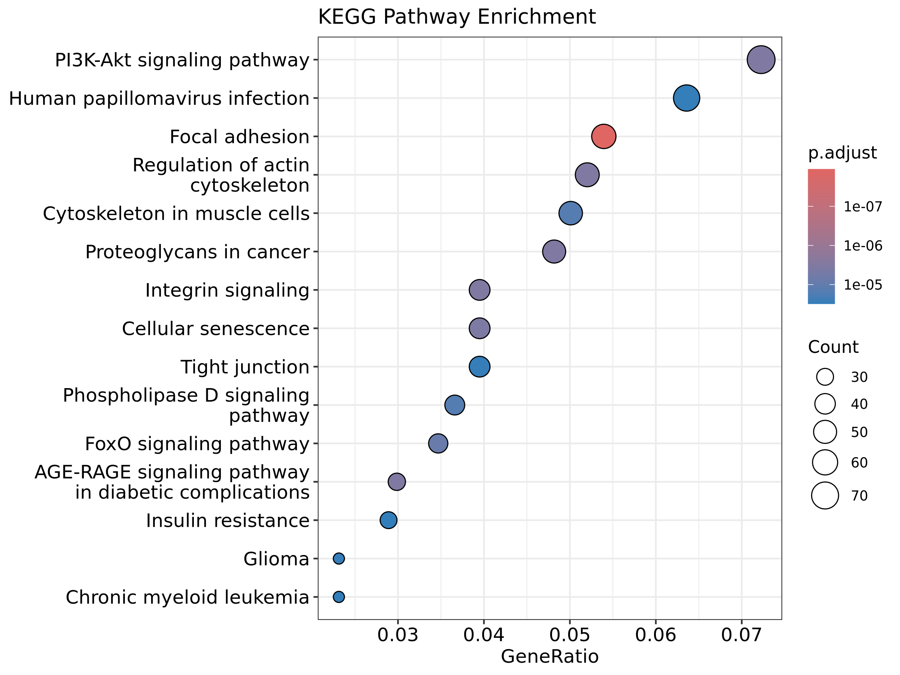

# RNA-seq 差异表达分析项目（salmon + DESeq2）

基于公开数据集 **GSE52778「airway」** 的 RNA-seq 全流程分析。数据来自 8 个人气道平滑肌细胞样本，使用 4 对配对样本比较地塞米松（dexamethasone）处理与未处理条件。项目已完成 FASTQ 下载与质控、salmon 转录本定量、tximport 基因汇总、DESeq2 差异分析、ggplot2 可视化，以及 GO/KEGG 富集分析。

> 仓库保留脚本、文档和 README 展示图。原始 FASTQ、参考序列、salmon 索引、定量中间文件，以及 `results/`、`figures/` 中的运行产物均在本地生成，不纳入 Git 仓库。

## 技术栈

| 环节 | 工具 | 说明 |
| --- | --- | --- |
| 数据下载 | wget / ENA（EBI） | 8 个 paired-end 50bp FASTQ 样本 |
| 质控 | FastQC + MultiQC | 下载完整性检查与质量汇总；本流程未执行修剪 |
| 定量 | salmon | 转录本拟比对和定量 |
| 参考注释 | Ensembl GRCh38 release-116 | cDNA 序列与 GTF 注释 |
| 差异分析 | tximport + DESeq2 | 负二项分布建模，BH 校正后使用 `padj` |
| 可视化 | ggplot2 + ggrepel | MA 图、火山图和富集气泡图 |
| 富集分析 | clusterProfiler | GO BP / KEGG 过表达分析 |

## 分析流程



## 目录结构

```text
rnaseq-project/
├── README.md
├── rnaseq_salmon_guide.md
├── docs/
│   └── images/                      # README 展示用 PNG
└── scripts/
    ├── make_tx2gene.py              # 从 GTF 生成 tx2gene.tsv / id2name.tsv
    ├── deseq2.R                     # tximport + DESeq2，输出结果表和 MA/火山图
    ├── enrichment.R                 # GO BP / KEGG 富集与气泡图
    └── plot_ggplot2.R               # 基于已有差异结果单独重画 MA/火山图
```

运行分析后会在本地生成 `fastq/`、`ref/`、`salmon_index/`、`quant/`、`qc/`、`results/` 和 `figures/`；这些目录均被 `.gitignore` 忽略。

## 关键结果

以下数字来自本项目的一次本机运行快照，用于说明预期输出；对应结果文件和图片不随仓库分发。

- 差异分析覆盖 **34,712 个基因**。
- 按 `padj < 0.05` 判定，共有 **2,140 个显著基因**，其中上调 **1,208 个**、下调 **932 个**。
- 若在 `padj < 0.05` 的基础上再要求 `|log2FC| > 1`，则得到上调 **383 个**、下调 **325 个**。
- 按 `padj` 排序，靠前的基因包括 **SPARCL1**、**PER1** 和 **ARHGEF2**。
- **ZBTB16** 是代表性显著上调基因：`log2FC = +5.61`，`padj = 3.56e-41`。
- 本次 GO BP 结果包含 **741 个显著条目**，KEGG 结果包含 **109 条显著通路**。在线数据库更新或重新运行可能产生变化。

## 结果输出

运行脚本后会在本地生成 `results/deseq2_results.txt`、富集结果表，以及 `figures/MAplot.*`、`figures/volcano.*`、`figures/GO_dotplot.*` 和 `figures/KEGG_dotplot.*`。完整结果目录不会上传到 GitHub；以下 PNG 是复制到 `docs/images/` 的展示副本。

## 结果可视化

<p align="center">
  
  
</p>

<p align="center">
  
  
</p>

## 结果解释

`padj` 是经过 Benjamini-Hochberg 多重检验校正后的显著性指标，不包含效应量阈值。`log2FC` 表示处理组相对于对照组的表达变化幅度，正值为上调、负值为下调。因此，2,140 个显著基因与 708 个同时满足 `|log2FC| > 1` 的基因属于两个不同的筛选层级，应分别说明。

当前 `deseq2.R` 使用 `design=~condition` 进行简化分析，没有把细胞系作为配对因素加入模型。GSE52778 的 4 个细胞系均包含配对的处理与对照样本，因此在更严格的复现中可改为 `~ cell + condition`。本轮文档保留现有分析结果，并将配对建模列为后续改进项。

## 快速开始

完整的数据下载、环境配置、salmon 定量和排障步骤见 [`rnaseq_salmon_guide.md`](rnaseq_salmon_guide.md)。以下命令可在项目根目录执行；脚本会根据自身位置自动定位项目根目录。

```bash
# 已准备好 ref/ 和 quant/ 后执行
mkdir -p results
cat > results/coldata.txt <<'EOF'
sample condition
SRR1039508 untreated
SRR1039509 treated
SRR1039512 untreated
SRR1039513 treated
SRR1039516 untreated
SRR1039517 treated
SRR1039520 untreated
SRR1039521 treated
EOF

python3 scripts/make_tx2gene.py
Rscript scripts/deseq2.R
Rscript scripts/enrichment.R
```

脚本会自动从 `ref/`、`quant/` 和 `results/coldata.txt` 读取输入，并将结果表与图片分别写入 `results/` 和 `figures/`。这些输出目录不会上传到 GitHub。

如需基于已有差异结果单独重画 MA 图和火山图，再执行：

```bash
Rscript scripts/plot_ggplot2.R
```

## 环境版本

主要环境为 WSL Ubuntu + conda 环境 `rnaseq`。本次运行使用的版本包括：

| 工具 / 包 | 版本 |
| --- | --- |
| salmon | 2.7.0 |
| FastQC | 0.12.1 |
| MultiQC | 1.35 |
| R | 4.5.3 |
| DESeq2 | 1.50.2 |
| tximport | 1.38.2 |
| clusterProfiler | 4.18.4 |
| ggplot2 | 4.0.3 |

完整版本表和安装命令见复现指南。当前命令没有锁定全部依赖版本，重新安装可能得到更新版本，因此科学计数和富集条目应以实际运行记录为准。

## 数据与分析边界

- GSE52778 是公开的真实数据，本项目用于展示和复现标准 RNA-seq 分析流程。
- 当前结果基于简化非配对模型，不能替代加入细胞系协变量后的正式差异分析。
- 下载链接、KEGG 在线数据库和注释版本可能随时间变化。
- FASTQ、参考文件、salmon 索引、`quant/`、`results/` 和 `figures/` 不随仓库分发，完整复现需要重新下载和计算。
- `docs/images/` 仅保留 README 展示所需的四张 PNG；PDF 和完整结果目录仍不纳入版本控制。

## 数据来源

- GEO：[GSE52778 airway](https://www.ncbi.nlm.nih.gov/geo/query/acc.cgi?acc=GSE52778)
- 原始测序数据：EBI ENA，样本编号见复现指南第 4 节
- 关联论文：Himes et al. (2014)，[DOI: 10.1371/journal.pone.0099625](https://doi.org/10.1371/journal.pone.0099625)
- 参考转录组和注释：[Ensembl GRCh38 release-116](https://ftp.ensembl.org/pub/release-116/)
